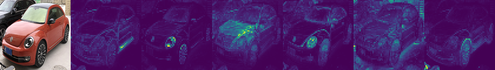
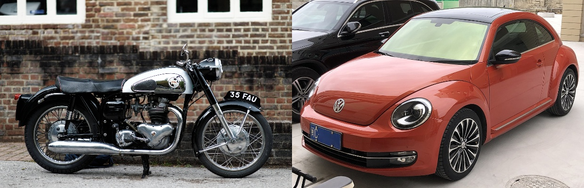

# Capstone-Project-1


*Image*: Visualization of last attention maps of the model

## Presentaion of Project
This projects is a captone project of the machine learning online class Machine Learning Zoomcamp held by Alexey Grigorev. In this project I wanted to try out a very-special current pre-trained backbone for computer vision tasks to perform a binary classification task.

## The Problem
In the context of autonomous driving the classification of vehicles is an integral part, since this allows other intelligent systems in cars to integrate this information in their decision making. For this purpose I am looking at a dataset that contains the two very common classes of vehicles: `car` and `bike`.

To tackle the problem I wanted to explore the capabilities of a specific Vision Transformer (ViT) type DINO (self-**DI**stillation with **NO** labels) that was pre-trained on large datasets that include ImageNet-1k. This pre-training was self-supervised and allows the ViT-backbone to extract *very strong* features for computer vision downstream tasks (incl. classification). As it is usual with Transformer-based models, such models compute so called `[cls]`-tokens (global context information) as well as `patch`-token (local context information). In the context of image classification, the `[cls]`-token output is more relevant.


*Image-Source*: [github.com/google-research/vision_transformer](https://github.com/google-research/vision_transformer)


For prediction of the object classes, a fully connected MLP head for binary classification is appened to the feature-extraction (encoder-) backbone.


## The Data
The dataset was obtained from Kaggle and can be found here: 
- https://www.kaggle.com/datasets/utkarshsaxenadn/car-vs-bike-classification-dataset/

After downloading the dataset, the folder `Car-Bike-Dataset` has to be placed into the `data`.

The data contains 2 classes:
1. `Car` (2000 images)
2. `Bike` (2000 images)



## EDA and Model-Tuning
The Data-Analysis and tuning of hyperparameter can be found in this [notebook](notebook.ipynb).


## Preparing the environments
For this project the deep learning library PyTorch is required. This is because of the dependency of the used ViT-backbone [DINO](https://github.com/facebookresearch/dino).

### `dev-env[-cpu|-gpu]` conda environment (for EDA and Training)
In this environment the dependencies from the aforementioned DINO-ViT will be installed and used during training. This environment is used for executing everything with PyTorch. It is strongly advised to use the gpu-version for training.

```sh
### Creating evn. + installing dependencies
# With GPU
conda env create -f conda-gpu.yaml 
conda activate dev-env-gpu

# Alternative: with CPU only (significantly slower training)
conda env create -f conda-cpu.yaml
conda activate dev-env-cpu

# For using the jupyter notebook
pip install jupyter notebook ipython
```


This environment is also used to train the final model with [train.py](train.py). If you use the cpu-version replace `gpu` with `cpu` from here on:
```sh
conda activate dev-env-gpu
python3 train.py
```

Alternatively to training, the trained model that is used in the project, can be found in the releases section.


### Pipenv environment for testing the Streamlit frontend
To send image data to the classification model used in the flask-app, a streamlit frontend is used. For this a pipenv-environment is used. To create the environment use the [Pipfile](Pipfile) located in the project folder:
```sh
# Install packages from Pipfile
pipenv install

##  Alternatively with virtualenv:
virtualenv streamlit-env -p python3.10
source streamlit-env/bin/activate
pip install flask==3.0.0 gunicorn==21.2.0 streamlit==1.29.0 requests==2.31.0
```

## Running the Code
The following subsection show how the developed prediction model can be run in differnt situations (locally without / with docker, with `docker-compose`)

### Running the prediction model locally without docker
```sh
## Console window 1:
conda activate dev-env-gpu # or cpu
# Deploy prediction model
gunicorn --bind=0.0.0.0:9696 predict:app

# Console window 2:
pipenv run python3 test.py
```

### Running the prediction model locally with docker

In the environment inside the docker-container the cpu-version of PyTorch is used. There is no Pipfile for deployment, however all dependencies can be found in the relevant dockerfile [image-predict.dockerfile](image-predict.dockerfile). The relevant part can be seen below:
```Dockerfile
RUN pip install flask==3.0.0 gunicorn==21.2.0
RUN pip install torch==2.0.1 torchvision==0.15.2 torchaudio==2.0.2 --index-url https://download.pytorch.org/whl/cpu
```

Building the docker-container:
```sh
docker build -t vehicle-predict:v1 -f image-predict.dockerfile .
```

Run the docker-container:
```sh
docker run -it --rm -p 9696:9696 vehicle-predict:v1
```

You can test if everything worked with the [test.py](test.py) script:
```sh
pipenv run python3 test.py
```

Alternatively it is possible to use a streamlit-frontend [streamlit_app.py](streamlit_app.py) for sending data to the flask-app for prediction:
```sh
pipenv run streamlit run streamlit_app.py 
```

With the Web-UI you can upload imges that will be send to the model.

### Running the prediction model locally with `docker-compose`
Finally the streamlit-app will also be packaged inside a docker container and is used in conjunction with the prediction docker-container. For this another [dockerfile](streamlit-app.dockerfile) is used. For the setup of both containers the file [docker-compose.yml](docker-compose.yml) is used.

Both containers are build and run with docker compose:
```sh
docker-compose up --build
```

To send images to the model, use the link that is provided by the streamlit-app.

## Results
The generalization properties of the pre-trained backbone have proven very effective for the task of image classification with  prediction accuracy of over 90% on training-, validation- and test-data.
